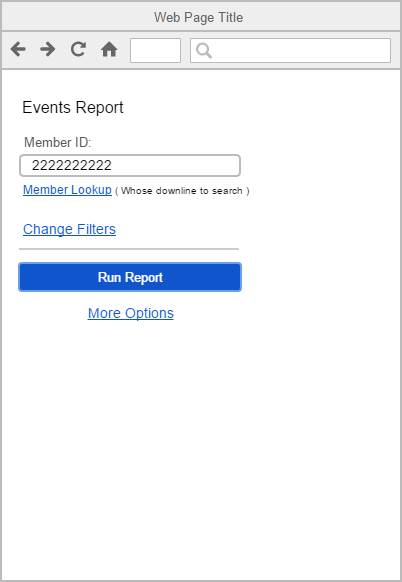
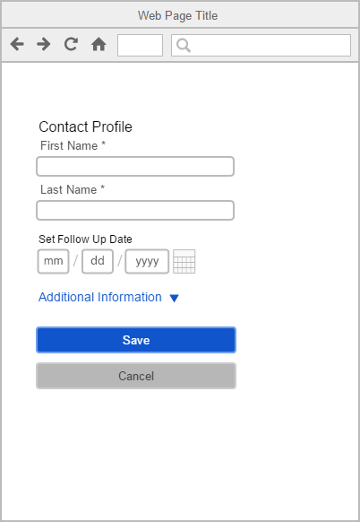
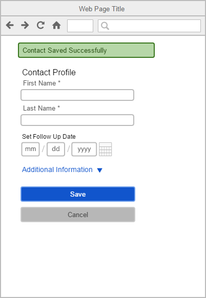
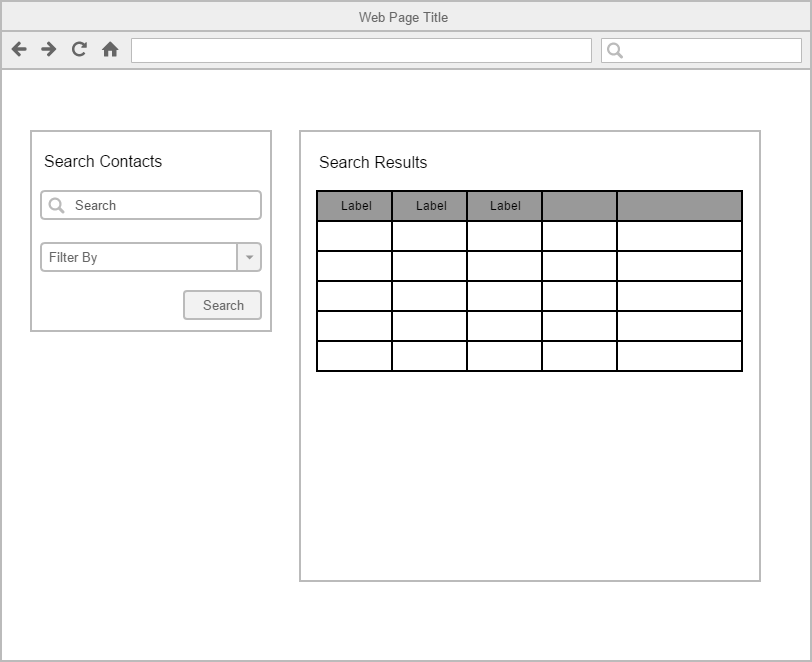

# ui-design-standards-and-principles
This document outlines discussion points from personal industry experience with UI design and development for large enterprise applications that are tool centric and aims at proposing a running specification of UI design standards and principles for such large tool sets. 
# Objective
The purpose of this document is to assist in solidifying UX requirements for Product Teams (Product Managers, Business Analysts, Designers, other stake holders) during the discovery and requirements gathering process. While most Agile shops simplify requirements in their user stories and acceptance criteria. It is my belief that these processes lack an underlying organizational UX framework to approach the UI design and development. 
# User Flow Standards
Define the UI in groups or sections that relate to all tools. Users intuitively will have the same expectations if we institute user flow standards, this reduces having to re-learn a new set of tools for any new feature that is launched under any application's tool set. 

1. Actions
    1. Basic and Advanced
        - At a bare bones minimum, any tool should be operable with a basic set of actions (submit, cancel, add, set, delete). 
        - This does involve in some cases making the UI smarter in order to anticipate a user action or guide (hook) the user into adopting the behavior that is optimal to making tool use efficient. (main goal: efficiency operating the tool)
        - Advanced users should be provided the ability to ‘open’ these advanced actions/settings that they can manipulate to achieve the customized result they are seeking.
2. User Input
    1. Required and Optional for Conversion (ROC)
        - At a bare bones minimum, we should only show what information we require of the user in order to successfully submit the form we are displaying to them.
        - Optional information, can be hidden and visible by providing the user the ability to enter this optional information should they wish to enter it.
        - Enable actions users can perform after making validated selections or validated data entries (Decreases the need for unnecessary null checking and logic is written to function precisely based on the user initiated trigger.) For example, don't enable a submit button until all requried information on the form is entered and validated. 
3. Results – also see Perceived Performance bullet point
    1. Users expect a result from their interactions with an application. This interactivity is crucial to an optimal UX.
        - Loaders to let user know application is processing their requests and actions. 
        - Loaders also freeze the page from user fat fingering or double clicking elements that can trigger application logic to process multiple times. 
    2. Error Handling
        - Any user triggered submission of any kind i.e., user entered data or user selection, will cause a request to our services and data bases to POST or GET data. The success or failure of these requests need to be communicated to the user, i.e., notification components (modal or inline).
    3. Form Validation and special cases
        - Required fields need to be validated for input and or certain patterns (.i.e., masks, emails, dates).
        - Errors should be cleared immediately after user enters valid input.
    4. Real-Time updates
        - User deletions or additions in lists or grids, need to be updated in real time. Some of this behavior comes out of the box in certain widgets in certain UI libraries, in other widgets it is configurable or is engineered from scratch. 
    5. Common Locations
        - Regardless of tools our users are interacting with, placement should be similar in layouts of common sections. For instance actions to perform on a page and or inner navigational items should have a consistent placement and design. This type of consistency increases the intuition we want from users when interacting with the tools. Common placement unifies the entire website. Style guide lines should also have placement guidelines of content/UI types.
4. Options (secondary, tertiary)
    - Any view a user visits needs to clearly define a conversion goal (CTA). Whether it is a download, a click through, a submission or another type of interaction we seek from the user. We should limit the ‘options’ or CTAs on a page so that users are clearly funneled into this conversion.
5. Perceived Performance – also see Results bullet point
    1. Intro article: [http://blog.teamtreehouse.com/perceived-performance](http://blog.teamtreehouse.com/perceived-performance)
        - Display loading iconography or progress bars (data submission, data retrieval, any action involving data over the server).
        - Lazy Loading
# Examples
## Actions - Basic and Advanced / Options (secondary, tertiary)

In this example we're looking at a reports generating tool. A UI should always account for new and experienced users and finding a balance to cater to both user types. New users will always be a basic user, until they get the familiarity needed to consider themselves advanced with the tool. Therefore, minifying options and clearly distinguishing the call to action, will let these basic users have success with the tool and feel confident with it. You can clearly see what the call to action is, and using a minimal approach secondary and tertiary options are easy to spot and are grouped relative to each other to minimize eye scanning. This view can be futher enhanced from the development perspective by leveraging local storage to save settings and the state of the UI for some of those advanced users. 

#### Mobile example

## User Input – Required and Optional for Conversion (ROC) 

In this example, we're looking at a contact form for a mobile CRM application. If you are familiar with CRM applications then this UI  should make sense. You can see that for a CRM a new contact's first name and last name are very important (hypothetically we're only showing First and Last Name, you would also want some contact information like email or phone number as well). Notice however that the Follow Up Date fields are not required but are shown here as an option. Again in a CRM application this is very beneficial information. The goal (conversion) of this page is to quickly add a contact and making that flow as easy as possible for the user on the go. 

## Results – Error Handling

Self-explanatory yet often missed. Users need to know their submissions are successful, but most importantly if those submissions error out. Users trust an application that can communicate with them. 

## Results – Common Locations

Any enterprise application will provide a suite of tools to either users or adminstrators. These tools will vary in functionality and feature sets. As well as UI components. They can be graphical represntations of data in charts or tables, form based UIs for CRUD operations, etc... Focusing on form and function from a design point of view. The different feature sets should share a common intuitiveness for new users to your application. One way of achieving this common intuitiveness is to leverage common page real estate for common hierarchal controls or actions. Many a time, within the same branded application I have come across common 2 column layouts, but yet find primary, secondary and tertiary functionality in different locations. Users shouldn't have to learn new layout patterns per each section of your application to become efficient at it. It should be automatic from one feature or section to the next where common controls are. KISS. Web design is not about aesthetic appeal, fit and finish come last, its about designing smarter functionality in an application and ease of use. 

## Perceived Performance – Page Processing/Loading

Let users know the application is performing for them. A simple yet commonly ignored UI component is a loading graphic. These build trust with the user that the application is processing what they are looking to achieve and mixed with error handling gives users even more confidence in the application. 

# Hierarchy Placement Map 
Hierarchy of content is a great strategy for setting the placement and flow content and call to actions to achieve those site goals. The following maps are based on a left to right language direction. Mobile is self-explanatory. 

#### Mobile example

Following this placement map, we can already see that this mobile UI would benefit from placement of the Save button in the top, perhaps fixated so the user can always see this action even as they scroll. 

